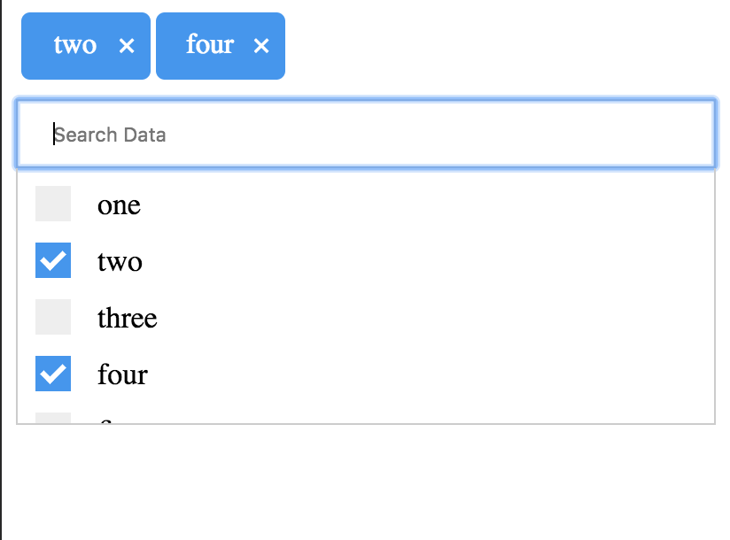

## React Multi Select Dropdown Component

React Multi Select Dropdown Component



## Installation:
`npm install --save multiselect-dropdown-react`

## Usage:
See the examples for how to use the component

```
import React, { Component } from 'react';
import './App.css';
import Multiselect from 'multiselect-dropdown-react';

const data = [{
  name: 'one',
  value: 'one'
},
{
    name: 'two',
    value: 'two'
  },
  {
    name: 'three',
    value: 'three'
  },
  {
    name: 'four',
    value: 'four'
  },
  {
    name: 'five',
    value: 'five'
  },
  {
    name: 'six',
    value: 'six'
  }];
class App extends Component {
  result(params) {
    console.log(params);
  }
  render() {
    return (
      <div className="App">
        <Multiselect options={data} onSelectOptions={this.result} />
      </div>
    );
  }
}

export default App;


```

## Component Usage
```
<Multiselect options={data} onSelectOptions={this.result} />

```
## License
MIT